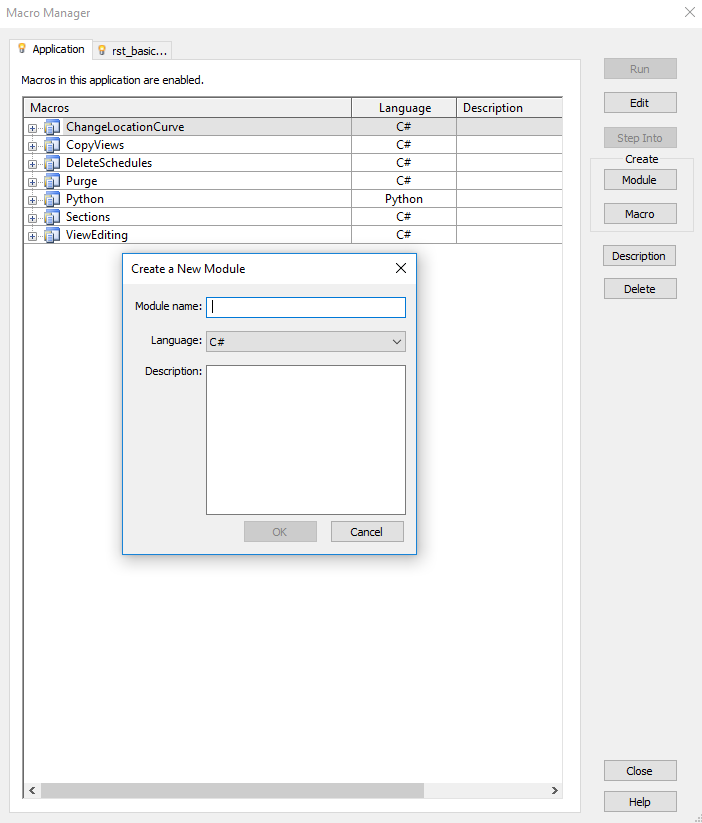

## WHY C#?
<hr>
1. Most of the examples online are written in C#    
2. Same language is used to build Zero Touch Nodes
3. Independent from Dynamo version
4. Faster execution and keyboard shortcuts available

note: 

---
## DISCLAIMER!
***
1. This is not a class on C# language
2. There are many C# fundamentals concept that will not be covered
3. I will give you lots of homework to do
---

## EXTENDING REVIT
***

1. External command
    - Commands are added to the External Tools pulldown in the ribbon Add-Ins tab

2. External application
    - Applications can create new panels in the ribbon Add-Ins tab
    - External applications can invoke external commands

3. SharpDevelop macro  

##### [source: ADN Revit Training Material, 1_Revit_API_Intro](https://github.com/ADN-DevTech/RevitTrainingMaterial/blob/master/Presentation/1_Revit_API_Intro.pptx)

---

## TOOLS
***
- *RevitLookup*  
Allows you to “snoop” into the Revit database structure. “must have” for any Revit API programmers. Available on ADN DevTech on [Github](https://github.com/jeremytammik/RevitLookup)

- *Add-In Manager*  
Allows you to load your dll while running Revit without registering an addin and to rebuild dll without restarting Revit. [more info here](http://teocomi.com/revit-add-in-manager-external-tools/)

<br>

##### [source: ADN Revit Training Material, 1_Revit_API_Intro](https://github.com/ADN-DevTech/RevitTrainingMaterial/blob/master/Presentation/1_Revit_API_Intro.pptx)
---

## REVIT API DOCUMENTATION
***
[revitapidocs](http://www.revitapidocs.com/) by Gui Talarico

[apidocs.co](https://apidocs.co/) by Gui Talarico

[Jeremy Tammik blog](http://thebuildingcoder.typepad.com/)

[Autodesk Developer Network](https://www.autodesk.com/developer-network/platform-technologies/revit)

[Revit Training Material](https://github.com/ADN-DevTech/RevitTrainingMaterial )

---
## LET'S CREATE A MACRO
***



---

## MACRO MANAGER
<hr>
*Application:*

Macro modules available to all opened Revit projects in the current instance of the Revit application.

<br>
*Active document tab:*

The active document tab represents the currently active project in Revit. The project does not necessarily contain embedded macros.

---

## SHARP DEVELOP
***
- Free IDE for C#, VB.NET and Python projects on Microsoft's .NET platform.
- Create a module first and then add a macro to it.

---

## PYTHON to C# #
***
1. When you declare a variable or constant, you must either specify its type or use the *var* keyword
2. You must end each statement with a semicolon;
3. Double quotes encode a string of multiple characters, single quotes encode a single character (data type *char*)
4. You don't need to worry about indentation

---

## PYTHON DELETE ELEMENTS
***

```python
#Copyright(c) 2016, Dimitar Venkov
# @5devene, dimitar.ven@gmail.com

import clr

clr.AddReference("RevitServices")
import RevitServices
from RevitServices.Persistence import DocumentManager
from RevitServices.Transactions import TransactionManager
clr.AddReference("RevitAPI")
import Autodesk
from Autodesk.Revit.DB import FilteredElementCollector

doc = DocumentManager.Instance.CurrentDBDocument

collector = FilteredElementCollector(doc).WhereElementIsNotElementType()

sheets = []

for c in collector:
	if c.Category != None and c.Category.Name == "Sheets":
			sheets.append(c)

result = []	

TransactionManager.Instance.EnsureInTransaction(doc)
for e in sheets:
	eid = e.Id
	try:
		doc.Delete(eid)
		result.append(str(eid)+" deleted")
	except:
		result.append(str(eid)+" failed")
TransactionManager.Instance.TransactionTaskDone()

OUT = result
```

---


## NAMESPACE
***
*Python*
```python
import clr
clr.AddReference("RevitServices")
import RevitServices
from RevitServices.Persistence import DocumentManager
from RevitServices.Transactions import TransactionManager
clr.AddReference("RevitAPI")
import Autodesk
from Autodesk.Revit.DB import FilteredElementCollector
```

*C#*
```csharp
using System;
using Autodesk.Revit.UI;
using Autodesk.Revit.DB;
using Autodesk.Revit.UI.Selection;
using System.Collections.Generic;
using System.Linq;
```

---

## DOCUMENT MANAGER
***
*Python*
```python
doc = DocumentManager.Instance.CurrentDBDocument
```

*C#*
```csharp
UIDocument uidoc = this.ActiveUIDocument;
Document doc = uidoc.Document;
```
note: Access the UI of the currently Revit project opened. The active or top most view of the project.

---

## SELECTION
***
*Python*
```python
collector = FilteredElementCollector(doc).WhereElementIsNotElementType()
```

*C#*
```csharp
FilteredElementCollector collector = new FilteredElementCollector(doc)
					.WhereElementIsNotElementType();
```

---

## ITERATION
***
*Python*

```python
sheets = []

for c in collector:
	if c.Category != None and c.Category.Name == "Sheets":
			sheets.append(c)
```

*C#*
```csharp
List<Element> sheets = new List<Element>();

foreach (Element e in collector) {
	if (e.Category != null && e.Category.Name == "Sheet")
		sheets.Add(e);
}
```

note: show how to retrieve the category name with RevitLookup. Show debug to check null

---

## TRANSACTION
***
*Python*

```python
TransactionManager.Instance.EnsureInTransaction(doc)
#Do something to the Revit model
TransactionManager.Instance.TransactionTaskDone()
```

*C#*
```csharp
using (Transaction t = new Transaction(doc))
{
t.Start("Delete Sheets");
//Do something to the Revit model
t.Commit();
}
```

---
## TRY CATCH
***

```python
try:
#Try something
except:
#Except
finally:
#Finally
```

```csharp
try{
	//Try something
}
catch{
	//Catch
}
finally{
	//Release
}
```

---

## PUT EVERYTHING TOGETHER
***
*Python*

```python
result = []
TransactionManager.Instance.EnsureInTransaction(doc)
for e in sheets:
	eid = e.Id
	try:
		doc.Delete(eid)
		result.append(str(eid)+" deleted")
	except:
		result.append(str(eid)+" failed")
TransactionManager.Instance.TransactionTaskDone()
```

---

*C#*
```csharp
string s = "";
	using (Transaction t = new Transaction (doc, "Delete Elements in View")){
	t.Start();
	foreach (Element e in sheets) {
		ElementId eid = e.Id;
		try{
			doc.Delete(eid);
			s += eid.ToString() + " deleted" + Environment.NewLine;
		}
		catch{
			s += eid.ToString() + " failed" + "/n";
		}
	}
	t.Commit();
}
TaskDialog.Show("Delete Elements in View", s);
```

---

## C# SYNTAX
***

```csharp
namespace allMyMacros{
	[Autodesk.Revit.Attributes.Transaction
	(Autodesk.Revit.Attributes.TransactionMode.Manual)]
    [Autodesk.Revit.DB.Macros.AddInId("C329BC57-C708-4670-9239-A40E1CED1CE0")]
	public partial class ThisApplication{
		public void MyFirstMacro()
    	{
    		TaskDialog.Show("Dialog Title", "My first Macro!");
   		}
	}
}
```

---
- Namespace
- Class
- Method

---
## LIST, COLLECTION, ILIST, ICOLLECTION

---
## ACCESS MODIFIERS
***
- **PUBLIC** Available to all callers with access to the type
- **PROTECTED**
- **INTERNAL**
- **PRIVATE**


[docs.microsoft.com](https://docs.microsoft.com/en-us/dotnet/csharp/language-reference/keywords/access-modifiers)

---

## METHODS
***
- **VOID** The method does not return anything. For example:
```csharp
void Ok_btnClick(object sender, EventArgs e)
{
usertext = textBox1.Text;
}
```
This method sets the value of a variable.

---

## RETURN
***
This method selects all the View template in the project and
return them as a list.
```csharp
public static List<View> collectTemplates(Document doc)
{
IEnumerable<View> fec = new FilteredElementCollector(doc).OfClass(typeof(View)).Cast<View>();

List<View> myVT = new List<View>();

foreach (View v in fec)
{
	if (v.IsTemplate) 
		{
		myVT.Add(v);  
		}
}
return myVT;
}
```

---
## CAST
***

---

## STATIC
***
No instance is required to be invoked.

```csharp
List<View> viewTemplates = collectTemplates(doc);
```
<br>
An instance can be created using the *new* keyword:

```csharp
FilteredElementCollector viewTypes = new FilteredElementCollector(doc)
	.OfClass(typeof(ViewFamilyType));
```

---

## WHY I NEED TO CREATE AN INSTANCE OF SOME CLASSES?
***

---

## CODE STRUCTURE

1. Store your methods in a separate Class (i.e. Helpers)
2. These methods must be *public static*
3. Add a Form to the project
4. Create an instance of the Form in ThisApplication
5. Call your methods from ThisApplication (i.e. Helpers.MethodName)

---

## HELPERS
***
```csharp
public static List<View> collectTemplates(Document doc){

IEnumerable<View> fec = new FilteredElementCollector(doc)
		.OfClass(typeof(View))
		.Cast<View>();
List<View> myVT = new List<View>();

foreach (View v in fec)
{
	if (v.IsTemplate){
		myVT.Add(v);
	}
}
return myVT;
}
```

```csharp
public static
```

```csharp
IEnumerable<View>
```

---

## FORM
```csharp
public partial class Form2 : frms.Form {
public int chosenView;
public Form2(Document doc) {
InitializeComponent();
List<View> viewTemplates = Helpers.collectTemplates(doc);
foreach (var v in viewTemplates) {
comboBoxDrop.Items.Add(v.Name);
}
}
void Form2Load(object sender, EventArgs e){ }
void ComboBox1SelectedIndexChanged(object sender, EventArgs e){
chosenView = comboBoxDrop.SelectedIndex;}
}
```

---

## FORM NAMESPACE
```csharp
using System;
using Autodesk.Revit.UI;
using Autodesk.Revit.DB;
using Autodesk.Revit.UI.Selection;
using System.Collections.Generic;
using System.Windows.Forms;
```
When you add the Revit namespace you'll get an error
```csharp
'Form' is an ambiguous reference between 'Autodesk.Revit.DB.Form' and
'System.Windows.Forms.Form' (CS0104)
```
You can solve the ambiguity:
```csharp
using winForms = System.Windows.Forms;
...
public partial class Form1 : winForms.Form
```

---

## Combobox Selected Index Changed Event
***
```csharp
void ComboBox1SelectedIndexChanged(object sender, EventArgs e)
{
chosenViewTemplate = comboBox1.SelectedIndex;
}
```

---

## Add the document as an argument of the form
***
```csharp
public CreateDraftingViewForm(Document doc)
```

---

## THIS APPLICATION
***
```csharp
public void PopulateDropDown()
{
UIDocument uidoc = this.ActiveUIDocument;
Document doc = uidoc.Document;
List<View> allViewTemplates = Helpers
			.collectTemplates(doc);
using(var forma = new Form2(doc)){
//use ShowDialog to show the form as a modal dialog box.
forma.ShowDialog();
TaskDialog.Show("result",
		allViewTemplates[forma.chosenView].Name);
}
```

---

## How to access properties inside classes
***
```csharp
TaskDialog.Show("ViewTemplateSelected", form.chosenViewTemplate);
```

---

## Use while to keep the Dialog box open
***
```csharp
string interrupt = "False";
while(interrupt == "False") {
form.ShowDialog();
if (form.usertext.Length >2) {
Helpers.AddDraftingView(doc, form.usertext, form.chosenTemplateId);
interrupt = "True";
}
else if (form.usertext == "") {
TaskDialog.Show("Error", "Please specify the view name"); }
else if (form.usertext.Length <2) {
TaskDialog.Show("Error", "The view name is too short");   }
else { TaskDialog.Show("Error", "I don't know what went wrong");  }
}
```
               

---

## HELLO WORLD!
***
```csharp
public void disallowBeamJoins(){
UIDocument uidoc = this.ActiveUIDocument;
Document doc = uidoc.Document;

ICollection<ElementId> selElementsIds = uidoc.Selection.GetElementIds();
List<Element> selElements = new List<Element>();
string selected = "";
foreach (var element in selElementsIds) {
	selected += element.ToString() +"\n";
	selElements.Add(doc.GetElement(element));	
}
TaskDialog.Show("Selected Element Id", selected)
}
```
---
## HELLO WORLD!
***
```csharp
using (Transaction t = new Transaction(doc, "Disallow Joins")){
	t.Start();
		foreach (Element e in selElements){
			FamilyInstance fa = e as FamilyInstance;
			StructuralFramingUtils.DisallowJoinAtEnd(fa, 0);
			StructuralFramingUtils.DisallowJoinAtEnd(fa, 1);
		}
	t.Commit();
}
TaskDialog.Show("title", selElements.Count.ToString());
}
```
---
<iframe src="https://giobel.github.io/PresentationCompDes18/compDes18Pres-export/loader" width= "1200"  height="500" scrolling="no"></iframe>

---
<a href="http://tt-acm.github.io/Spectacles.WebViewer/" data-preview-link>spectacles</a>