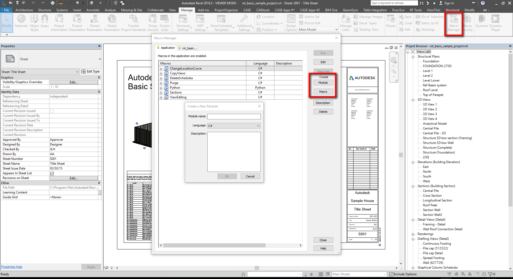

## WHY C#?

1. Most of the examples online are written in C#    
2. Same language is used to build Zero Touch Nodes
3. Independent from Dynamo version
4. Faster execution and keyboard shortcuts available

note: 

---
## DISCLAIMER!
***
1. This is not a class on C# language
2. There are many C# fundamentals concept that will not be covered
3. You will leave with lots of homework to do
---

## EXTENDING REVIT
***

1. External command
    - Commands are added to the External Tools pulldown in the ribbon Add-Ins tab

2. External application
    - Applications can create new panels in the ribbon Add-Ins tab
    - External applications can invoke external commands

3. SharpDevelop macro  

##### [source: ADN Revit Training Material, 1_Revit_API_Intro](https://github.com/ADN-DevTech/RevitTrainingMaterial/blob/master/Presentation/1_Revit_API_Intro.pptx)

---

## LET'S CREATE A MACRO
***

---
